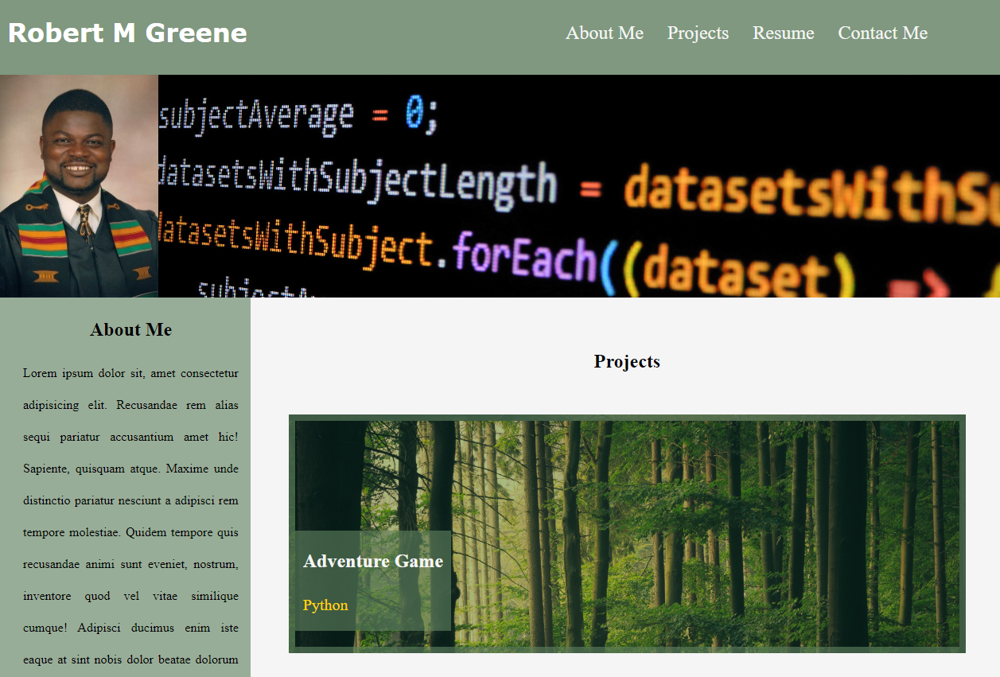

# Portfolio

## Table of contents

- [Overview](#overview)
 - [The challenge](#the-challenge)
  - [User Story](#user-story)
  - [Acceptance Criteria](#acceptance-criteria)
  - [Screenshot](#screenshot)
  - [Links](#links)
- [My process](#my-process)
  - [Built with](#built-with)
  - [What I learned](#what-i-learned)
- [Author](#author)

## Overview

### The challenge

This project aims to showcase my skills to potential employers. In it, I apply core CSS skills including flexbox, media queries, and CSS variables. 

### User Story

AS AN employer
I WANT to view a potential employee's deployed portfolio of work samples
SO THAT I can review samples of their work and assess whether they're a good candidate for an open position

### Acceptance Criteria

GIVEN I need to sample a potential employee's previous work
WHEN I load their portfolio
THEN I am presented with the developer's name, a recent photo or avatar, and links to sections about them, their work, and how to contact them
WHEN I click one of the links in the navigation
THEN the UI scrolls to the corresponding section
WHEN I click on the link to the section about their work
THEN the UI scrolls to a section with titled images of the developer's applications
WHEN I am presented with the developer's first application
THEN that application's image should be larger in size than the others
WHEN I click on the images of the applications
THEN I am taken to that deployed application
WHEN I resize the page or view the site on various screens and devices
THEN I am presented with a responsive layout that adapts to my viewport

### Screenshot

### Links

- Solution URL: [Portfolio](https://github.com/Monkonjay/Portfolio.git)
- Live Site: [Test the Project](https://monkonjay.github.io/Portfolio/)

## My process

### Built with

- CSS
- HTML5

### What I learned

The primary experience in this project was working with CSS and flexbox. It was good experience positioning elements on the page. I found it an efficient approach using CSS variables.

## Author

- Website - [Robert M Greene]( https://monkonjay.github.io/Portforlio-Page/)
- Github - [Monkonjay](https://github.com/Monkonjay)
